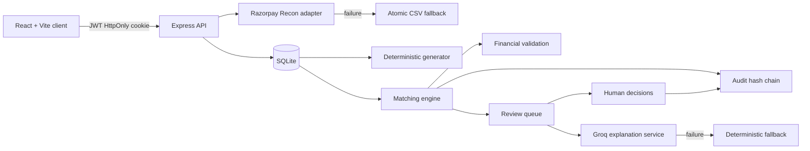

# SettleWise AI

Verification-first settlement reconciliation that links deterministic evidence, financial anomalies, human review and an immutable audit trail.

## Problem

Settlement reconciliation is often a spreadsheet-heavy process in which identifiers, fees, GST, refunds and payout timing must all be checked independently. A high-confidence identity match can still contain a financial anomaly, while an amount-only candidate may be unsafe to link automatically. SettleWise AI makes those distinctions explicit for a synthetic, single-merchant hackathon workflow.

## Solution

SettleWise AI imports Razorpay Settlement Recon-format records, generates a deterministic labelled order batch, constructs and scores candidates, blocks unsafe automatic links, and surfaces every remaining record for review. Authoritative calculations use integer paise. Optional Groq explanations are stored separately and cannot alter a match, amount, score or status.

## Verified canonical results

The frozen `phase6-held-out-seed` evaluation uses synthetic fallback data. These values are measured, not acceptance claims or hard-coded dashboard values.

| Metric | Verified result |
|---|---:|
| Total orders | 150 |
| Ground-truth pairable records | 146 |
| Correct automatic matches | 123 |
| Total-batch automation coverage | 82.00% (123/150) |
| Known-pair automatic recall | 84.25% (123/146) |
| Automatic-match precision | 100% |
| False positives | 0 |
| Pending review | 23 |
| Unresolved | 4 |
| Non-automatic records surfaced | 27/27 |
| Exception recall | 90% |
| Core matching duration | 140 ms |
| Unexplained financial variance | ₹268.51 |

The original aspirational 85% automation and 90% recall targets conflicted with the frozen anomaly distribution and mandatory amount, date and ambiguity safety gates. They were replaced with safety-oriented acceptance criteria: at least 95% automatic-match precision, zero silent loss, complete surfacing of non-automatic records, mandatory violation blocking, ambiguity review, honest coverage/recall/false-positive reporting, and deterministic processing under 30 seconds. No matching rules, labels, confidence thresholds, held-out seed or dataset records were changed. See the preserved [false-negative diagnostic](docs/canonical-false-negative-diagnostic.md).

## Key features

- Razorpay Settlement Recon adapter with atomic Razorpay-format CSV fallback
- Deterministic 150-order canonical generator and isolated evaluation truth
- Integer-paise fee, GST, refund, net and variance calculations
- Indexed candidate construction with an IST calendar-date window
- Deterministic confidence components, hard gates and reason codes
- Matched, pending-review and unresolved classifications with complete evidence
- Transactional approve, reject and manual-link review actions
- SHA-256 append-only audit hash chain with verification
- Advisory Groq anomaly explanations with deterministic fallback text
- Formula-injection-safe CSV export and exact-confirmation data reset
- React dashboard, records details drawer, review queue and responsive navigation

## Screenshots

> Add publication screenshots without including credentials or real merchant data.

- `docs/screenshots/dashboard.png` — canonical metrics and reconciliation summary
- `docs/screenshots/record-details.png` — deterministic match and financial evidence
- `docs/screenshots/review-queue.png` — ambiguity review and advisory AI section
- `docs/screenshots/audit-log.png` — verified audit hash chain

## Architecture



The matching engine never reads `evaluation_truth`. Ground truth is isolated for post-match evaluation metrics and is never returned by production APIs.

## Deterministic matching workflow

1. Look up payment candidates by exact merchant order ID.
2. If unavailable, try an exact receipt against records without an order ID.
3. If identity is missing, consider amount/date candidates within ±3 IST calendar days.
4. Score identifier, exact gross, date proximity and financial-formula agreement.
5. Apply mandatory amount/date and prior-manual-link hard gates.
6. Apply the ambiguity gate when top candidates tie or are within five points.
7. Persist status, ranked candidates, confidence components, reason codes and financial evidence atomically.

Candidate ambiguity, amount mismatch, an out-of-window date or weak identity cannot be hidden by AI prose.

## Confidence scoring

| Component | Points |
|---|---:|
| Exact order ID | 50 |
| Exact receipt fallback | 45 |
| Exact gross amount | 25 |
| Date difference 0–1 / 2 / 3 IST days | 15 / 12 / 8 |
| Fee, GST and refund formula agreement | 10 |

Scores of 85–100 can auto-match only when every hard gate passes and the candidate is unambiguous. Scores of 60–84 go to review; lower scores are unresolved. Financial discrepancies remain visible through reason codes, exception indicators and variance.

## Financial formula

All authoritative money values are integer paise:

```text
expected_fee = gross × 2 / 100
expected_GST = expected_fee × 18 / 100
expected_net = gross - expected_fee - expected_GST - refunds
actual_net   = provider_credit - linked_refund_debits
variance     = actual_net - expected_net
```

Inputs that do not resolve to whole paise are rejected rather than rounded through floating-point arithmetic.

## AI safety boundary

Groq receives only minimal structured anomaly evidence. `GROQ_MODEL` defaults to `openai/gpt-oss-20b`. AI output is advisory and stored separately; it cannot change settlement links, confidence scores, financial amounts, classifications or metrics. Missing, invalid or unavailable Groq access produces deterministic fallback text without blocking reconciliation.

## Technology stack

- Client: React 19, Vite 7, React Router, TanStack Query, Tailwind CSS, Recharts
- Server: Node.js, Express, JavaScript ESM
- Data: SQLite through `better-sqlite3`, SQL migrations, no ORM
- Security: bcrypt, JWT cookie authentication, Helmet, CORS allowlist and rate limits
- Tests: Vitest and Supertest
- Deployment target: Vercel client and Railway server with a persistent volume

## Repository structure

```text
.
├── client/
│   └── src/
│       ├── api/
│       ├── components/{charts,feedback,layout,tables}/
│       ├── hooks/
│       ├── lib/
│       ├── pages/
│       └── routes/
├── server/
│   ├── src/
│   │   ├── config/
│   │   ├── db/migrations/
│   │   ├── middleware/
│   │   ├── modules/{audit,auth,batches,explanations,exports,generator,ingestion,reconciliation,reviews}/
│   │   ├── providers/
│   │   └── utils/
│   └── test/{fixtures,integration,unit}/
├── docs/
├── package.json
└── SettleWise_AI_Technical_Specification.md
```

## Local setup

Requirements: Node.js 22 and npm.

```sh
npm ci
cp server/.env.example server/.env
npm run password:hash --workspace server
npm run db:migrate
npm run user:seed --workspace server
npm run dev
```

Put the generated bcrypt hash in `ADMIN_PASSWORD_HASH`. Never store or commit the plaintext password. The client runs at `http://localhost:5173` and the API defaults to `http://localhost:4000`.

## Environment variables

| Variable | Purpose |
|---|---|
| `NODE_ENV` | `development`, `test` or `production` |
| `PORT` | Express port; defaults to `4000` |
| `DATABASE_PATH` | SQLite file; use `/data/settlewise.db` on Railway |
| `CLIENT_ORIGIN` | Exact permitted frontend origin |
| `JWT_SECRET` | Random secret of at least 32 bytes |
| `JWT_TTL` | Session lifetime; defaults to `8h` |
| `ADMIN_EMAIL` | Single seeded login email |
| `ADMIN_PASSWORD_HASH` | Bcrypt hash only |
| `RAZORPAY_KEY_ID` / `RAZORPAY_KEY_SECRET` | Optional server-side test credentials |
| `RAZORPAY_API_BASE_URL` / `RAZORPAY_TIMEOUT_MS` | Recon provider endpoint and timeout |
| `GROQ_API_KEY` | Optional anomaly-explanation credential |
| `GROQ_API_BASE_URL` / `GROQ_MODEL` / `GROQ_TIMEOUT_MS` | Groq endpoint, model and timeout |
| `MAX_BATCH_SIZE` / `MAX_CSV_BYTES` | Validated service limits |
| `LOG_LEVEL` | Server logging level |
| `VITE_API_BASE_URL` | Railway API URL used during the Vercel build |

Use `server/.env.example` as the source-of-truth template. `.env` files are ignored.

## Tests and verification

```sh
npm run lint
npm test
npm run test:ground-truth
npm run build
```

The server suite includes the complete CSV → generation → reconciliation workflow and a deterministic 500-record performance assertion under 30 seconds.

## Razorpay API to CSV fallback

Create a batch in API mode, choose the reconciliation date and try the Razorpay fetch. Provider or credential failures return a structured error and reveal the CSV fallback. Upload a Razorpay-format CSV; parsing and insertion are atomic, so one invalid row rejects the entire file with zero inserted records. API and CSV records share the same normalization path.

## Deployment

### Railway API

1. Create a Railway service from this repository with the root directory unchanged.
2. Mount one persistent volume at `/data` and run exactly one replica.
3. Set `DATABASE_PATH=/data/settlewise.db`, `NODE_ENV=production`, the exact Vercel `CLIENT_ORIGIN`, a random `JWT_SECRET`, `ADMIN_EMAIL` and a bcrypt `ADMIN_PASSWORD_HASH`.
4. Add optional Razorpay and Groq credentials only in Railway variables.
5. Build with `npm ci`; start with `npm run db:migrate && npm start`.
6. Configure `/health` as the Railway health check and verify HTTPS public networking.
7. Create a volume backup before the pitch.

### Vercel client

1. Import the repository and set the project root to `client`.
2. Use `npm run build` and output directory `dist`.
3. Set `VITE_API_BASE_URL` to the HTTPS Railway service URL.
4. Configure SPA rewrites to `index.html` if the Vercel project does not add them automatically.
5. Redeploy the API after setting `CLIENT_ORIGIN` to the final Vercel origin, then test the cross-site production cookie.

## API summary

| Method | Endpoint | Purpose |
|---|---|---|
| `GET` | `/health` | Process and database health |
| `POST` | `/api/v1/auth/login` | Single-account login |
| `POST` | `/api/v1/auth/logout` | End session |
| `GET` | `/api/v1/auth/me` | Current user |
| `GET/POST` | `/api/v1/batches` | List or create batches |
| `GET` | `/api/v1/batches/:batchId` | Batch and metrics |
| `POST` | `/api/v1/batches/:batchId/settlements/fetch` | Razorpay Recon fetch |
| `POST` | `/api/v1/batches/:batchId/settlements/upload` | Atomic CSV fallback |
| `POST` | `/api/v1/batches/:batchId/orders/generate` | Deterministic 150-order generation |
| `POST` | `/api/v1/batches/:batchId/reconcile` | Atomic deterministic reconciliation |
| `GET` | `/api/v1/batches/:batchId/records` | Paginated records |
| `GET` | `/api/v1/batches/:batchId/review-queue` | Paginated review queue |
| `GET` | `/api/v1/matches/:matchId` | Match details |
| `POST` | `/api/v1/matches/:matchId/{approve,reject,manual-link}` | Transactional review action |
| `POST` | `/api/v1/matches/:matchId/explanation/retry` | Advisory explanation retry |
| `GET` | `/api/v1/batches/:batchId/export.csv` | Protected CSV export |
| `GET` | `/api/v1/audit-logs` | Paginated audit events |
| `GET` | `/api/v1/audit-logs/verify` | Hash-chain verification |
| `DELETE` | `/api/v1/data` | Exact-confirmation reset preserving login |

## Demo workflow

1. Log in with the deployment-managed demo account.
2. Create a 150-order API-mode batch and trigger the Razorpay failure path.
3. Upload the canonical synthetic fallback CSV.
4. Generate exactly 150 orders with the held-out seed and reconcile.
5. Inspect dashboard metrics and deterministic record evidence.
6. Review an ambiguous record, generate advisory fallback text, approve or reject, then manually link another record.
7. Verify the audit chain and export a protected CSV.

## Limitations

- Synthetic single-merchant INR demo; it does not represent real merchant data or measured revenue impact.
- Canonical coverage is 82.00% of all orders and Known-pair automatic recall is 84.25%; neither is presented as meeting the retired aspirational targets.
- Fee and tax-labelled canonical cases also violate exact gross, so mandatory safety gates hold them for review.
- SQLite deployment requires one Railway replica, a persistent volume and backups.
- Provider access depends on external test credentials; CSV fallback is the reproducible demo path.

## Repository security rules

- Never commit `.env` files, SQLite databases, credentials, plaintext passwords, generated exports, logs or `node_modules`.
- Keep Razorpay, Groq and JWT secrets server-side in deployment variables.
- Never expose `evaluation_truth` through APIs, logs or client bundles.
- Use only synthetic, non-PII fixtures and screenshots.
- Preserve formula-injection protection on CSV exports.
- Review `git status` and run a secret scan before every publication.

## Hackathon pitch

SettleWise AI demonstrates that settlement automation can prioritize defensible precision over inflated coverage. In five minutes: show the API-to-CSV fallback, generate and reconcile the frozen 150-order batch, explain the 100% measured precision and complete surfacing of 27 non-automatic records, inspect deterministic evidence separately from AI advice, record a human decision, and verify the immutable audit chain.
