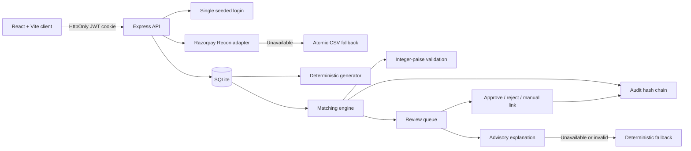

# SettleWise AI

Verification-first settlement reconciliation for synthetic Razorpay-format data, with deterministic evidence, human review, and a tamper-evident audit trail.

## Live demo

- Application: [https://settlewise-ai.vercel.app](https://settlewise-ai.vercel.app)
- Backend health: [https://settlewise-api-production.up.railway.app/health](https://settlewise-api-production.up.railway.app/health)
- Demo email: `admin@settlewise.local`
- Demo password: provide it with the hackathon submission

The production password, password hash, JWT secret, and provider credentials are intentionally not stored in this public repository. For a local deployment, generate your own password hash using the setup instructions below.

## Hackathon track

**AI Finance Controller** — a 48-hour hackathon MVP focused on explainable settlement control.

## Problem statement

Settlement reconciliation requires checking identifiers, gross amounts, dates, fees, GST, refunds, and payouts across provider exports. A likely identity match can still contain a financial anomaly, while an amount-only candidate may be unsafe to link. Reviewers need automation with defensible evidence.

This is a synthetic, single-merchant INR demonstration. It contains no real merchant data and makes no production-compliance or measured-revenue-impact claim.

## Solution overview

SettleWise AI imports Razorpay Settlement Recon-format records, generates a deterministic labelled order batch, scores candidates, blocks unsafe automatic links, and surfaces every non-automatic record. The server is authoritative for metrics and integer-paise calculations. Optional Groq text explains anomalies but never participates in matching.

## Key features

- Razorpay adapter with atomic, shared-normalization CSV fallback
- Deterministic 150-order generator with isolated evaluation truth
- Integer-paise fee, GST, refund, net, and variance calculations
- IST date window, deterministic confidence components, and hard gates
- Matched, pending-review, and unresolved classifications with reason codes
- Transactional approve, reject, and manual-link actions
- Separate deterministic evidence and advisory AI explanations
- Append-only SHA-256 audit hash chain and verification
- Formula-injection-protected CSV export and exact-confirmation reset
- Responsive dashboard, record details drawer, review queue, and audit log

## Verified canonical results

The frozen `phase6-held-out-seed` evaluation uses synthetic fallback data. These are measured results, not hard-coded dashboard values or claims that retired aspirational targets were met.

| Metric                          | Verified result |
| ------------------------------- | --------------: |
| Total orders                    |             150 |
| Ground-truth pairable records   |             146 |
| Correct automatic matches       |             123 |
| Total-batch automation coverage |          82.00% |
| Known-pair automatic recall     |          84.25% |
| Automatic-match precision       |            100% |
| False positives                 |               0 |
| Pending review                  |              23 |
| Unresolved                      |               4 |
| Non-automatic records surfaced  |           27/27 |
| Exception recall                |             90% |
| Matching duration               |          140 ms |
| Unexplained variance            |         ₹268.51 |

Lower recall is caused by mandatory protection: **11 gross mismatches, 4 date-window violations, 8 identity ambiguities, and 4 unresolved cases**. The original aspirational automation and recall targets conflicted with this frozen anomaly distribution and the safety gates. No matching rules, labels, confidence thresholds, held-out seed, or dataset records were changed. In particular, 84.25% is not presented as meeting an 85% target, and the 146 ground-truth pairable records are not all automatically eligible.

## How reconciliation works

1. Find candidates by exact merchant order ID.
2. If unavailable, use an exact receipt only against records without an order ID.
3. For missing identity, consider amount/date candidates within ±3 IST calendar days.
4. Score identity, gross amount, date proximity, and financial-formula agreement.
5. Apply amount, date, prior-link, and ambiguity hard gates.
6. Classify each order as `matched`, `pending_review`, or `unresolved`.
7. Atomically store evidence, ranked candidates, components, reason codes, financial values, audit events, and server-calculated metrics.

`evaluation_truth` is used only after reconciliation to measure the synthetic evaluation. Matching functions do not read it, and production APIs do not serialize it.

## Confidence scoring and hard gates

| Component | Points |
| --- | ---: |
| Exact order ID | 50 |
| Exact receipt fallback | 45 |
| Exact gross amount | 25 |
| Date difference 0–1 / 2 / 3 IST days | 15 / 12 / 8 |
| Fee, GST, and refund formula agreement | 10 |

A score of 85–100 can auto-match only if every hard gate passes and the best candidate is unambiguous. Scores of 60–84 enter review; lower scores are unresolved. Amount mismatch, a date outside ±3 IST days, or a settlement already linked elsewhere blocks automatic matching. A tie or top-two score difference of five points or less goes to review.

All authoritative money values are integer paise:

```text
expected_fee = gross × 2 / 100
expected_GST = expected_fee × 18 / 100
expected_net = gross - expected_fee - expected_GST - refunds
actual_net   = provider_credit - linked_refund_debits
variance     = actual_net - expected_net
```

## AI safety boundary

Groq receives minimal structured anomaly evidence only. Output is advisory and stored separately; it cannot modify a link, score, amount, status, or metric. A missing key, invalid response, timeout, or provider failure produces deterministic fallback text without changing match state. `GROQ_MODEL` defaults to `openai/gpt-oss-20b`.

## System architecture



## Technology stack

- **Client:** React 19, Vite 7, React Router, TanStack Query, Tailwind CSS, Recharts
- **Server:** Node.js 22, Express 5, JavaScript ESM
- **Data:** SQLite via `better-sqlite3`, SQL migrations, no ORM
- **Security:** bcrypt, JWT cookie authentication, Helmet, exact-origin CORS, rate limits
- **Tests:** Vitest and Supertest

## Project folder structure

```text
.
├── client/
│   ├── src/{api,components,hooks,lib,pages,routes}/
│   ├── .env.example
│   └── package.json
├── server/
│   ├── src/
│   │   ├── config/
│   │   ├── db/migrations/
│   │   ├── middleware/
│   │   ├── modules/{audit,auth,batches,explanations,exports,generator,ingestion,reconciliation,reviews}/
│   │   ├── providers/
│   │   └── utils/
│   ├── test/{fixtures,integration,unit}/
│   ├── .env.example
│   └── package.json
├── docs/
├── package.json
├── package-lock.json
└── SettleWise_AI_Technical_Specification.md
```

## Prerequisites

- Node.js 22.x, npm, and Git
- A writable local directory for SQLite
- Optional Razorpay test credentials
- Optional Groq API key

## Complete local setup

```sh
git clone https://github.com/VisheshAgarwal0089/settlewise_ai.git
cd settlewise_ai
npm ci
cp server/.env.example server/.env
cp client/.env.example client/.env
```

PowerShell equivalents:

```powershell
Copy-Item server/.env.example server/.env
Copy-Item client/.env.example client/.env
```

Edit the copied files with local values. Never commit either `.env` file.

## Environment-variable configuration

Server variables are validated by `server/src/config/env.js`.

| Variable | Required or optional | Example placeholder | Purpose |
| --- | --- | --- | --- |
| `NODE_ENV` | Optional | `development` | Runtime mode |
| `PORT` | Optional | `4000` | Express port |
| `DATABASE_PATH` | Optional | `./data/settlewise.db` | SQLite path |
| `CLIENT_ORIGIN` | Optional locally; required in deployment | `http://localhost:5173` | Exact permitted frontend origin |
| `JWT_SECRET` | Required in production | `replace-with-at-least-32-random-bytes` | HS256 secret, at least 32 characters |
| `JWT_TTL` | Optional | `8h` | Token lifetime using `s`, `m`, `h`, or `d` |
| `ADMIN_EMAIL` | Optional locally; set explicitly in deployment | `admin@example.invalid` | Single login email |
| `ADMIN_PASSWORD_HASH` | Optional locally; set explicitly in deployment | `<bcrypt-hash>` | Bcrypt hash, never plaintext |
| `RAZORPAY_KEY_ID` | Optional | `<razorpay-test-key-id>` | Server-side key; CSV works without it |
| `RAZORPAY_KEY_SECRET` | Optional | `<razorpay-test-key-secret>` | Server-side secret; CSV works without it |
| `RAZORPAY_API_BASE_URL` | Optional | `https://api.razorpay.com/v1` | Provider base URL |
| `RAZORPAY_TIMEOUT_MS` | Optional | `8000` | Provider timeout |
| `GROQ_API_KEY` | Optional | `<groq-api-key>` | Enables provider explanations |
| `GROQ_API_BASE_URL` | Optional | `https://api.groq.com/openai/v1` | Groq-compatible base URL |
| `GROQ_MODEL` | Optional | `openai/gpt-oss-20b` | Explanation model |
| `GROQ_TIMEOUT_MS` | Optional | `8000` | Explanation timeout |
| `MAX_BATCH_SIZE` | Optional | `500` | Batch limit, maximum 500 |
| `MAX_CSV_BYTES` | Optional | `5242880` | Maximum upload bytes |
| `LOG_LEVEL` | Optional | `info` | Pino log level |

| Client variable | Required or optional | Example placeholder | Purpose |
| --- | --- | --- | --- |
| `VITE_API_BASE_URL` | Optional locally; required in deployment | `http://localhost:4000` | API base URL used at build time |

## Database migration and user seeding

Generate a bcrypt hash without placing the plaintext password in command history:

```sh
npm run password:hash --workspace server
```

Enter the password on standard input, then send EOF (`Ctrl+D` on Unix-like terminals; `Ctrl+Z`, then Enter, in Windows console hosts). Put only the emitted hash in `ADMIN_PASSWORD_HASH`, then run:

```sh
npm run db:migrate
npm run user:seed --workspace server
```

Migrations are idempotent. Seeding creates or updates the user identified by `ADMIN_EMAIL`.

## Starting frontend and backend

```sh
npm run dev
```

The client defaults to `http://localhost:5173`; the server defaults to `http://localhost:4000`. Separate terminals can use:

```sh
npm run dev --workspace server
npm run dev --workspace client
```

## Login flow

1. Migrate and seed the configured user.
2. Open `http://localhost:5173/login`.
3. Enter `ADMIN_EMAIL` and the password used to generate `ADMIN_PASSWORD_HASH`.
4. The server validates bcrypt credentials and sets an HttpOnly JWT cookie.
5. Protected pages check `GET /api/v1/auth/me`; logout clears the cookie. There is no registration.

## Complete application workflow

1. Log in and create a batch.
2. Select a reconciliation date and try Razorpay import.
3. On failure, upload a valid CSV; validation and insertion are atomic.
4. Generate exactly 150 deterministic orders, optionally with a seed.
5. Reconcile and inspect server-calculated dashboard metrics.
6. Open Records for authoritative details and deterministic evidence.
7. Use Review queue to approve, reject, or manually link; optionally request advisory text.
8. Verify the audit chain and export CSV.
9. Reset only by typing `RESET ALL DATA` exactly; the seeded login remains.

## Razorpay API configuration

Set both `RAZORPAY_KEY_ID` and `RAZORPAY_KEY_SECRET` to enable the adapter. It calls `GET /settlements/recon/combined` under `RAZORPAY_API_BASE_URL`, sends `year`, `month`, optional `day`, and paginates with `count` and `skip`. Credentials stay server-side.

Credentials are optional because CSV fallback is supported. Missing credentials, network failures, timeouts, invalid responses, and provider errors yield `RAZORPAY_UNAVAILABLE`.

## CSV fallback schema and usage

Headers are required in this exact order:

```csv
entity_id,type,amount,currency,fee,tax,credit,debit,settled,created_at,settled_at,settlement_id,settlement_utr,order_id,order_receipt,payment_id
```

| Fields | Accepted format |
| --- | --- |
| `entity_id` | Non-empty and unique within the upload |
| `type` | `payment`, `refund`, `transfer`, or `adjustment` |
| `amount`, `fee`, `tax`, `credit`, `debit` | Non-negative integer paise |
| `currency` | Exactly `INR` |
| `settled` | Boolean or `0` / `1` |
| `created_at` | Positive Unix seconds |
| `settled_at` | Unix seconds or empty |
| Identifier columns | Text or empty where optional |

On **Upload & generate**, choose a `.csv` file and **Upload CSV fallback**. Wrong headers, duplicate IDs, malformed rows, unsupported currencies, or invalid money/timestamps reject the entire upload with zero inserted rows. See [the CSV schema](docs/csv-schema.md).

## Groq configuration and deterministic fallback

Set `GROQ_API_KEY` only on the backend. The base URL, model, and timeout can override validated defaults. With no key or invalid provider output, deterministic fallback text is stored. Both paths leave links, scores, amounts, statuses, and metrics unchanged.

## API endpoint summary

Except health and login, `/api/v1` routes require authentication.

| Method | Endpoint | Purpose |
| --- | --- | --- |
| `GET` | `/health` | Process and SQLite health |
| `POST` | `/api/v1/auth/login` | Login |
| `POST` | `/api/v1/auth/logout` | Logout |
| `GET` | `/api/v1/auth/me` | Current user |
| `GET`, `POST` | `/api/v1/batches` | List or create batches |
| `GET` | `/api/v1/batches/:batchId` | Batch counts and metrics |
| `POST` | `/api/v1/batches/:batchId/settlements/fetch` | Razorpay import |
| `POST` | `/api/v1/batches/:batchId/settlements/upload` | Atomic CSV import |
| `POST` | `/api/v1/batches/:batchId/orders/generate` | Generate 150 orders |
| `POST` | `/api/v1/batches/:batchId/reconcile` | Atomic reconciliation |
| `GET` | `/api/v1/batches/:batchId/records` | Paginated records |
| `GET` | `/api/v1/batches/:batchId/review-queue` | Paginated review queue |
| `GET` | `/api/v1/batches/:batchId/export.csv` | Protected CSV export |
| `GET` | `/api/v1/matches/:matchId` | Match details and evidence |
| `POST` | `/api/v1/matches/:matchId/approve` | Approve |
| `POST` | `/api/v1/matches/:matchId/reject` | Reject |
| `POST` | `/api/v1/matches/:matchId/manual-link` | Manual link |
| `POST` | `/api/v1/matches/:matchId/explanation/retry` | Advisory explanation |
| `GET` | `/api/v1/audit-logs` | Paginated audit events |
| `GET` | `/api/v1/audit-logs/verify` | Verify hash chain |
| `DELETE` | `/api/v1/data` | Exact-confirmation reset |

See [the API reference](docs/api.md) for response envelopes.

## Testing commands

```sh
npm test
npm run test:ground-truth
npm run lint
```

`npm test` runs both workspace suites. Ground-truth verification runs the Phase 3 and Phase 6 integration tests, including the frozen evaluation. The server suite also covers ingestion, deterministic generation, reviews, explanations, export/reset, and a deterministic 500-record performance assertion.

## Production build commands

```sh
npm run build
npm start
```

The first command builds the Vite client. The second starts Express directly; there is no server compilation. Set production variables before startup.

## Railway backend deployment

1. Create a service from the repository root with **one replica**.
2. Attach a persistent volume at `/data`.
3. Set `DATABASE_PATH=/data/settlewise.db`.
4. Build with `npm ci`.
5. Start with `npm run db:migrate && npm start` so migrations run after the volume mounts.
6. Configure `/health` as the health check.
7. Set `NODE_ENV=production`, `CLIENT_ORIGIN=<exact-vercel-url>`, a unique `JWT_SECRET`, `ADMIN_EMAIL`, and `ADMIN_PASSWORD_HASH`. Add provider variables only if enabled.
8. Enable HTTPS networking, run the seed once against the mounted database, and create a volume backup.

SQLite requires the single replica and persistent volume.

## Vercel frontend deployment

1. Import the repository and set **Root Directory** to `client`.
2. Set **Build Command** to `npm run build`.
3. Set **Output Directory** to `dist`.
4. Set `VITE_API_BASE_URL` to the Railway HTTPS URL and deploy.
5. Update Railway `CLIENT_ORIGIN` to the exact Vercel URL and restart the backend.
6. Verify login and protected routes. Both origins must use HTTPS for the production cross-site cookie.

If direct React Router URLs return 404, configure the Vercel project with an SPA rewrite to `index.html`.

## Security controls

- Bcrypt verification, one seeded account, and no registration
- HttpOnly JWT; `Secure` and `SameSite=None` in production
- Login/API rate limits, Helmet, exact CORS, and mutation origin checks
- Validated environment and rejection of the development JWT secret in production
- Parameterized SQL and transactional ingestion, reviews, and reconciliation
- Integer-paise authority, linked SHA-256 audit events, and protected CSV cells
- Atomic invalid-CSV rejection and exact reset phrase
- No production endpoint for `evaluation_truth`
- Secrets, `.env`, databases, logs, exports, builds, coverage, and `node_modules` must remain untracked

## Known limitations

- Synthetic, single-merchant INR workflow; no production-compliance claim.
- Total-batch automation coverage is 82.00%; Known-pair automatic recall is 84.25%. Mandatory gates retain the rest for review or mark them unresolved.
- Canonical fee/tax anomaly cases also have exact-gross violations, so the amount gate blocks them.
- Razorpay live import depends on external test credentials; CSV is the reproducible fallback.
- SQLite deployment needs one Railway replica, persistent storage, and backups.
- Provider AI is optional; deterministic fallback remains available.

## Demo flow

1. Log in with the configured reviewer account.
2. Create an API-mode batch and show the Razorpay-to-CSV failure path.
3. Upload synthetic canonical CSV and generate 150 orders with the held-out seed.
4. Reconcile; show honest coverage/recall, 100% measured precision, and all 27 non-automatic records surfaced.
5. Contrast deterministic details with advisory AI text.
6. Approve or reject a pending record, manually link another, and verify the audit chain.
7. Export CSV. Do not reset a batch needed as judging evidence.

## Documentation links

- [SettleWise AI Technical Specification](SettleWise_AI_Technical_Specification.md)
- [Canonical false-negative diagnostic](docs/canonical-false-negative-diagnostic.md)
- [CSV fallback schema](docs/csv-schema.md)
- [API reference](docs/api.md)
- [Demo script](docs/demo-script.md)

## Screenshots

> Placeholders: capture only the synthetic workflow, without credentials or browser storage.

- `docs/screenshots/dashboard.png` — dashboard metrics
- `docs/screenshots/record-details.png` — deterministic evidence drawer
- `docs/screenshots/review-queue.png` — review and separated AI advisory
- `docs/screenshots/audit-log.png` — audit events and chain verification
