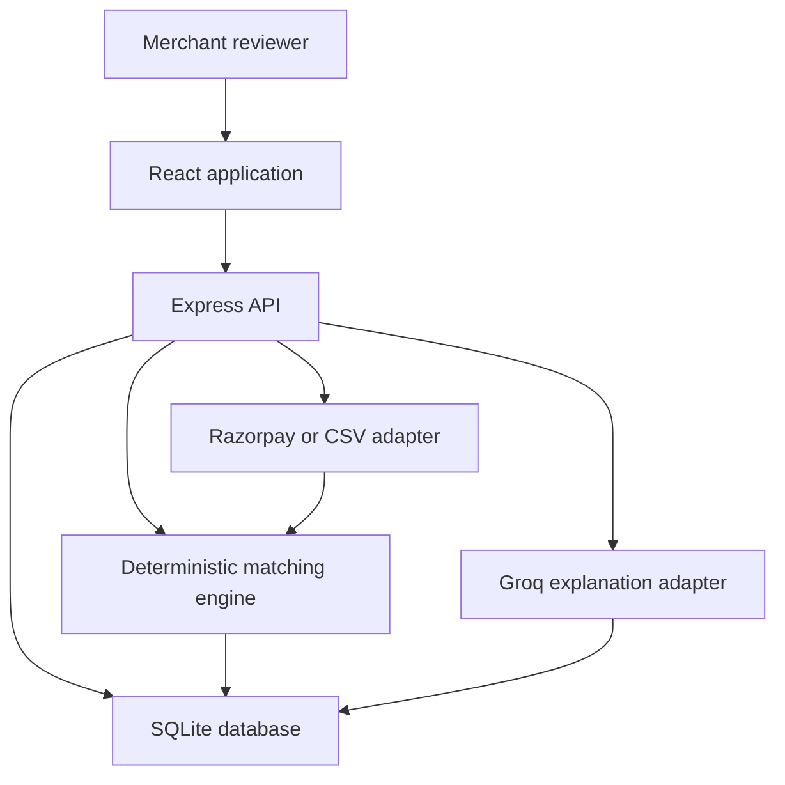

# SettleWise AI — Technical Specification

**Track:** AI Finance Controller  
**Scope:** 48-hour hackathon MVP  
**Deadline:** 4 September 2026, 00:00 IST  
**Deliverables:** Git repository, deployed application, five-minute pitch  
**Document status:** Implementation baseline

> Important correction: the originally selected Groq model, `llama-3.1-8b-instant`, was retired for free/developer-tier access on 16 August 2026. This specification therefore uses Groq's recommended replacement, `openai/gpt-oss-20b`, configured through `GROQ_MODEL` rather than hard-coded.[^groq-deprecation]

## Objective & Scope

### Objective

SettleWise AI is a verification-first finance controller for a single merchant. It reconciles a batch of synthetic merchant orders against Razorpay settlement-reconciliation records, reports measurable match quality and throughput, routes uncertain matches to a human review queue, explains anomalies with AI, and preserves an append-only audit trail.

The primary demo processes exactly 150 orders. The implementation must support up to 500 orders per batch and complete deterministic reconciliation in less than 30 seconds.

### Success criteria

- Automatic-match precision is at least 95%.
- Zero silent record loss: every non-automatic record is surfaced in `pending_review` or `unresolved`.
- Mandatory amount and date violations are blocked from automatic matching.
- Ambiguous candidates are routed to human review.
- Total-batch automation coverage, known-pair automatic recall and false-positive count are reported honestly from the current batch.
- Deterministic batch processing completes in under 30 seconds.
- A batch of up to 500 records completes deterministic matching in under 30 seconds.
- Every non-matched record appears in `pending_review` or `unresolved`; no record is silently discarded.
- The application demonstrates both:
  - Razorpay API failure followed by CSV fallback.
  - An ambiguous candidate blocked from automatic matching and sent to review.
- AI explanations are advisory only and do not alter amounts, confidence scores, links or statuses.

### In scope

- Single merchant and one login account.
- INR amounts and IST presentation only.
- React + Vite frontend.
- Node.js + Express backend.
- SQLite persistent database.
- Razorpay Settlement Recon API ingestion using test credentials when available.
- Razorpay-format CSV fallback when credentials or API access fail.
- On-demand generation of 150 synthetic merchant orders.
- Deterministic order-to-settlement-recon matching.
- Exact gross-amount comparison.
- Settlement-date tolerance of ±3 calendar days.
- Expected fee calculation of 2% of gross amount.
- Expected GST calculation of 18% of the fee.
- Refund adjustment.
- Confidence classification:
  - `>= 85`: automatic `matched`.
  - `60–84`: `pending_review`.
  - `< 60`: `unresolved`.
- Conflict rule: tied or near-tied top candidates are never auto-matched.
- Reviewer actions: approve, reject and manual link.
- AI-generated anomaly explanation using Groq.
- Append-only audit events for upload/fetch, generation, match result, approval and rejection; manual linking is also logged because it changes a financial link.
- Dashboard, Upload/Generate, Records Table, Review Queue and Audit Log pages.
- CSV export.
- Reset All Data operation with explicit confirmation.
- Unit tests for the matching engine.
- One upload-to-match integration test.
- Ground-truth metric assertions.
- Railway backend deployment with a persistent volume.
- Vercel frontend deployment.
- Desktop layout with basic mobile responsiveness.

### Out of scope

- Multiple merchants or tenant isolation.
- Registration, password recovery, multiple users or role-based access control.
- Bank-statement reconciliation.
- Grouped or split settlement inference.
- Many-to-many matching.
- Multi-currency support.
- Timezones other than IST for display.
- Conversational settlement Q&A.
- AI-controlled matching, approval or money movement.
- Live payment capture, refund creation, payout creation or settlement modification.
- Bookkeeping journal creation, tax filing or cash forecasting.
- Production-grade KYC, PCI-DSS or regulatory certification.
- Batches over 500 orders.
- PDF or Excel export.
- Background job infrastructure, message queues or horizontal scaling.
- Post-hackathon roadmap implementation.

## Tech Stack

Exact dependency versions must be committed in `package-lock.json`. Major-version ranges below are the compatibility contract; do not upgrade majors during the 48-hour build.

| Layer | Technology | Version | Why |
|---|---|---:|---|
| Runtime | Node.js | 22.x LTS | Stable LTS runtime with native test/runtime APIs and broad package compatibility |
| Language | JavaScript, ESM | ECMAScript 2024 | Lowest setup overhead for the fixed Node/Express stack |
| Frontend | React | 19.x | Component-based dashboard UI |
| Frontend build | Vite | 7.x | Fast development server and compact production build |
| Routing | React Router | 7.x | Five-page client-side navigation |
| Server state | TanStack Query | 5.x | Request caching, mutation state and refetch control |
| Styling | Tailwind CSS | 4.x | Fast responsive implementation |
| Charts | Recharts | 3.x | KPI and status distribution charts |
| Backend | Express | 5.x | Required Node.js HTTP framework |
| Validation | Zod | 4.x | Shared request, CSV-row and environment validation |
| Database | SQLite | 3.x | Single-merchant, low-volume persistent store |
| SQLite driver | better-sqlite3 | 12.x | Synchronous transactions and predictable local performance |
| CSV parsing | csv-parse | 6.x | Strict streaming CSV parsing |
| File upload | Multer | 2.x | Multipart upload handling with size/type limits |
| Authentication | jsonwebtoken + bcryptjs | Current stable, lockfile-pinned | One-user credential verification and signed sessions |
| HTTP client | Native `fetch` | Node 22 built-in | Razorpay and Groq calls without an extra client dependency |
| Security | Helmet, CORS, express-rate-limit | Current stable, lockfile-pinned | Secure headers, origin restriction and abuse controls |
| Logging | Pino | 9.x | Structured server logs without logging financial payloads or secrets |
| AI provider | Groq OpenAI-compatible API | `v1` | Low-latency anomaly explanations |
| AI model | `openai/gpt-oss-20b` | Environment-configured | Documented replacement for the retired Llama model |
| Test runner | Vitest | 4.x | Unit and integration tests across client/server JavaScript |
| Frontend hosting | Vercel | Managed | Static React deployment |
| Backend hosting | Railway | Managed | Express hosting plus attached persistent volume |

## System Architecture



### Component responsibilities

| Component | Responsibilities | Must not do |
|---|---|---|
| React application | Login, ingestion controls, generation controls, KPIs, records, review actions, audit display, CSV export and reset confirmation | Calculate authoritative confidence or financial results |
| Express API | Authentication, validation, orchestration, transactions, pagination, error mapping and secure provider access | Expose provider secrets or trust client-calculated amounts |
| Razorpay adapter | Fetch Settlement Recon pages, normalize upstream errors, redact credentials and return a provider-neutral structure | Modify upstream records or silently replace failed API data |
| CSV adapter | Validate Razorpay Recon-compatible headers/rows and import them through the same normalization path as API records | Accept malformed rows or silently coerce invalid amounts/dates |
| Seed generator | Generate 150 synthetic orders and labelled anomalies against imported settlement records | Change imported settlement source data |
| Matching engine | Normalize, build candidates, score, apply thresholds, detect ambiguity and produce evidence | Call Groq or make probabilistic financial decisions |
| Review service | Approve, reject or manually link records in a transaction | Overwrite prior review/audit history |
| Groq adapter | Explain `pending_review` and `unresolved` anomalies from structured evidence | Select candidates, change scores, create links or approve records |
| SQLite | Persist source rows, results, reviews, explanations, metrics and audit events | Serve as a shared multi-replica database |
| Evaluation service | Compare results against hidden ground truth and calculate honest metrics | Include unlabeled live API rows in ground-truth claims |

### External API basis

Use Razorpay Settlement Recon rather than only settlement summaries:

```text
GET https://api.razorpay.com/v1/settlements/recon/combined
    ?year=YYYY&month=MM&day=DD&count=N&skip=N
```

This endpoint exposes transaction-level fields including `order_id`, `order_receipt`, `amount`, `fee`, `tax`, `type`, `settlement_id`, `settlement_utr`, `created_at` and `settled_at`, which are needed for order-level reconciliation.[^razorpay-recon]

Authentication uses HTTP Basic Auth:

- Username: `RAZORPAY_KEY_ID`
- Password: `RAZORPAY_KEY_SECRET`

Provider amounts are integer paise and remain integer paise throughout the application.

## Project Folder Structure

```text
settlewise-ai/
├── client/
│   ├── public/
│   ├── src/
│   │   ├── api/
│   │   │   ├── authApi.js
│   │   │   ├── batchesApi.js
│   │   │   ├── recordsApi.js
│   │   │   └── reviewsApi.js
│   │   ├── components/
│   │   │   ├── layout/
│   │   │   ├── charts/
│   │   │   ├── tables/
│   │   │   └── feedback/
│   │   ├── pages/
│   │   │   ├── LoginPage.jsx
│   │   │   ├── DashboardPage.jsx
│   │   │   ├── DataSourcePage.jsx
│   │   │   ├── RecordsPage.jsx
│   │   │   ├── ReviewQueuePage.jsx
│   │   │   └── AuditLogPage.jsx
│   │   ├── hooks/
│   │   ├── lib/
│   │   │   ├── apiClient.js
│   │   │   ├── currency.js
│   │   │   └── dates.js
│   │   ├── routes/
│   │   ├── App.jsx
│   │   ├── main.jsx
│   │   └── index.css
│   ├── .env.example
│   ├── package.json
│   └── vite.config.js
├── server/
│   ├── src/
│   │   ├── config/
│   │   │   ├── env.js
│   │   │   └── constants.js
│   │   ├── db/
│   │   │   ├── connection.js
│   │   │   ├── migrate.js
│   │   │   ├── seedAdmin.js
│   │   │   └── migrations/
│   │   ├── middleware/
│   │   │   ├── auth.js
│   │   │   ├── errorHandler.js
│   │   │   ├── requestId.js
│   │   │   └── validate.js
│   │   ├── modules/
│   │   │   ├── auth/
│   │   │   ├── batches/
│   │   │   ├── ingestion/
│   │   │   ├── generator/
│   │   │   ├── reconciliation/
│   │   │   │   ├── normalize.js
│   │   │   │   ├── candidateBuilder.js
│   │   │   │   ├── scoreCandidate.js
│   │   │   │   ├── reconcileBatch.js
│   │   │   │   ├── metrics.js
│   │   │   │   └── reasonCodes.js
│   │   │   ├── reviews/
│   │   │   ├── explanations/
│   │   │   ├── audit/
│   │   │   └── exports/
│   │   ├── providers/
│   │   │   ├── razorpayClient.js
│   │   │   └── groqClient.js
│   │   ├── utils/
│   │   ├── app.js
│   │   └── server.js
│   ├── test/
│   │   ├── fixtures/
│   │   ├── unit/
│   │   └── integration/
│   ├── .env.example
│   └── package.json
├── docs/
│   ├── api.md
│   ├── csv-schema.md
│   └── demo-script.md
├── package.json
├── package-lock.json
└── README.md
```

## Data Model

### Global conventions

- Primary business IDs are UUID strings generated by the server.
- Provider IDs remain opaque strings.
- Monetary values use integer paise in columns ending `_paise`; floating-point arithmetic is forbidden.
- Timestamps are stored as UTC ISO-8601 text and rendered in IST.
- Boolean values use SQLite `INTEGER` constrained to `0` or `1`.
- Structured evidence and raw provider payloads use validated JSON text.
- Foreign keys and WAL mode are enabled on every database connection.
- All write operations affecting reconciliation use transactions.

### `users`

Single seeded login account. No registration endpoint.

| Field | SQLite type | Constraints / meaning |
|---|---|---|
| `id` | TEXT | PK, UUID |
| `email` | TEXT | NOT NULL, UNIQUE, normalized lowercase |
| `password_hash` | TEXT | NOT NULL, bcrypt hash only |
| `created_at` | TEXT | NOT NULL, UTC ISO timestamp |
| `last_login_at` | TEXT | NULLABLE, UTC ISO timestamp |

Indexes: unique index on `email`.

### `batches`

One ingestion and reconciliation run.

| Field | SQLite type | Constraints / meaning |
|---|---|---|
| `id` | TEXT | PK, UUID |
| `name` | TEXT | NOT NULL, length 1–80 |
| `source_mode` | TEXT | CHECK `api` or `csv` |
| `status` | TEXT | CHECK `uploaded`, `processing`, `completed`, `failed` |
| `requested_count` | INTEGER | CHECK 1–500 |
| `order_count` | INTEGER | NOT NULL DEFAULT 0 |
| `settlement_record_count` | INTEGER | NOT NULL DEFAULT 0 |
| `matching_started_at` | TEXT | NULLABLE |
| `matching_completed_at` | TEXT | NULLABLE |
| `matching_duration_ms` | INTEGER | NULLABLE, non-negative |
| `explanation_duration_ms` | INTEGER | NULLABLE, non-negative |
| `auto_match_rate` | REAL | NULLABLE, 0–1 |
| `precision` | REAL | NULLABLE, 0–1 |
| `recall` | REAL | NULLABLE, 0–1 |
| `exception_recall` | REAL | NULLABLE, 0–1 |
| `false_match_rate` | REAL | NULLABLE, 0–1 |
| `manual_review_rate` | REAL | NULLABLE, 0–1 |
| `unexplained_variance_paise` | INTEGER | NULLABLE |
| `error_code` | TEXT | NULLABLE, safe machine-readable error |
| `created_at` | TEXT | NOT NULL |
| `updated_at` | TEXT | NOT NULL |

Indexes: `(created_at DESC)`, `status`.

### `data_imports`

Tracks API attempts and CSV uploads without storing credential data.

| Field | SQLite type | Constraints / meaning |
|---|---|---|
| `id` | TEXT | PK, UUID |
| `batch_id` | TEXT | FK → `batches.id`, ON DELETE CASCADE |
| `source` | TEXT | CHECK `razorpay_api` or `csv_fallback` |
| `status` | TEXT | CHECK `started`, `succeeded`, `failed` |
| `record_count` | INTEGER | NOT NULL DEFAULT 0 |
| `file_name` | TEXT | NULLABLE, sanitized base filename only |
| `file_sha256` | TEXT | NULLABLE |
| `provider_http_status` | INTEGER | NULLABLE |
| `error_code` | TEXT | NULLABLE; never raw provider response |
| `created_at` | TEXT | NOT NULL |
| `completed_at` | TEXT | NULLABLE |

Indexes: `batch_id`, `(batch_id, created_at DESC)`.

### `orders`

Synthetic merchant-side orders.

| Field | SQLite type | Constraints / meaning |
|---|---|---|
| `id` | TEXT | PK, UUID |
| `batch_id` | TEXT | FK → `batches.id`, ON DELETE CASCADE |
| `merchant_order_id` | TEXT | NOT NULL; aligns to Razorpay `order_id` for normal cases |
| `order_receipt` | TEXT | NULLABLE |
| `gross_amount_paise` | INTEGER | NOT NULL, > 0 |
| `refund_amount_paise` | INTEGER | NOT NULL DEFAULT 0, >= 0 and <= gross |
| `expected_fee_paise` | INTEGER | NOT NULL, >= 0 |
| `expected_tax_paise` | INTEGER | NOT NULL, >= 0 |
| `expected_net_paise` | INTEGER | NOT NULL |
| `order_date_utc` | TEXT | NOT NULL |
| `currency` | TEXT | NOT NULL CHECK `INR` |
| `generation_case` | TEXT | CHECK `normal`, `amount_mismatch`, `date_mismatch`, `missing_reference`, `duplicate_candidate`, `fee_mismatch`, `tax_mismatch`, `refund_mismatch`, `missing_settlement` |
| `created_at` | TEXT | NOT NULL |

Constraints: unique `(batch_id, merchant_order_id)`.

Indexes: `batch_id`, `(batch_id, merchant_order_id)`, `(batch_id, gross_amount_paise)`, `(batch_id, order_date_utc)`.

### `settlement_records`

Normalized Razorpay Settlement Recon lines from API or CSV.

| Field | SQLite type | Constraints / meaning |
|---|---|---|
| `id` | TEXT | PK, UUID |
| `batch_id` | TEXT | FK → `batches.id`, ON DELETE CASCADE |
| `import_id` | TEXT | FK → `data_imports.id`, ON DELETE CASCADE |
| `entity_id` | TEXT | NOT NULL, provider transaction ID |
| `type` | TEXT | CHECK `payment`, `refund`, `transfer`, `adjustment` |
| `order_id` | TEXT | NULLABLE |
| `order_receipt` | TEXT | NULLABLE |
| `payment_id` | TEXT | NULLABLE |
| `settlement_id` | TEXT | NULLABLE |
| `settlement_utr` | TEXT | NULLABLE |
| `amount_paise` | INTEGER | NOT NULL, >= 0 |
| `fee_paise` | INTEGER | NOT NULL DEFAULT 0, >= 0 |
| `tax_paise` | INTEGER | NOT NULL DEFAULT 0, >= 0 |
| `credit_paise` | INTEGER | NOT NULL DEFAULT 0, >= 0 |
| `debit_paise` | INTEGER | NOT NULL DEFAULT 0, >= 0 |
| `currency` | TEXT | NOT NULL CHECK `INR` |
| `settled` | INTEGER | NOT NULL CHECK 0/1 |
| `created_at_utc` | TEXT | NOT NULL |
| `settled_at_utc` | TEXT | NULLABLE |
| `raw_payload_json` | TEXT | NOT NULL, validated and secret-free |
| `created_at` | TEXT | NOT NULL |

Constraints: unique `(batch_id, entity_id)`.

Indexes: `batch_id`, `(batch_id, order_id)`, `(batch_id, order_receipt)`, `(batch_id, amount_paise)`, `(batch_id, settled_at_utc)`, `(batch_id, settlement_id)`.

### `matches`

One current reconciliation result per order. Prior state changes remain recoverable through review and audit events.

| Field | SQLite type | Constraints / meaning |
|---|---|---|
| `id` | TEXT | PK, UUID |
| `batch_id` | TEXT | FK → `batches.id`, ON DELETE CASCADE |
| `order_id` | TEXT | FK → `orders.id`, ON DELETE CASCADE |
| `settlement_record_id` | TEXT | NULLABLE FK → `settlement_records.id` |
| `status` | TEXT | CHECK `matched`, `pending_review`, `unresolved` |
| `confidence_score` | INTEGER | NOT NULL CHECK 0–100 |
| `matched_by` | TEXT | CHECK `engine`, `reviewer`, `none` |
| `expected_net_paise` | INTEGER | NOT NULL |
| `actual_net_paise` | INTEGER | NULLABLE |
| `variance_paise` | INTEGER | NULLABLE |
| `reason_codes_json` | TEXT | NOT NULL JSON array |
| `evidence_json` | TEXT | NOT NULL JSON object with candidate scores and refund record IDs |
| `algorithm_version` | TEXT | NOT NULL, initially `1.0.0` |
| `review_note` | TEXT | NULLABLE, max 500 characters |
| `created_at` | TEXT | NOT NULL |
| `updated_at` | TEXT | NOT NULL |

Constraints: unique `order_id`.

Indexes: `(batch_id, status)`, `(batch_id, confidence_score DESC)`, `settlement_record_id`.

### `review_actions`

Append-only human decisions.

| Field | SQLite type | Constraints / meaning |
|---|---|---|
| `id` | TEXT | PK, UUID |
| `match_id` | TEXT | FK → `matches.id`, ON DELETE CASCADE |
| `user_id` | TEXT | FK → `users.id` |
| `action` | TEXT | CHECK `approve`, `reject`, `manual_link` |
| `previous_status` | TEXT | NOT NULL |
| `resulting_status` | TEXT | NOT NULL |
| `previous_settlement_record_id` | TEXT | NULLABLE |
| `selected_settlement_record_id` | TEXT | NULLABLE |
| `note` | TEXT | NULLABLE, max 500 |
| `created_at` | TEXT | NOT NULL |

Indexes: `match_id`, `(user_id, created_at DESC)`.

### `ai_explanations`

AI output is stored separately from authoritative match evidence.

| Field | SQLite type | Constraints / meaning |
|---|---|---|
| `id` | TEXT | PK, UUID |
| `match_id` | TEXT | FK → `matches.id`, ON DELETE CASCADE |
| `provider` | TEXT | NOT NULL DEFAULT `groq` |
| `model` | TEXT | NOT NULL |
| `prompt_version` | TEXT | NOT NULL DEFAULT `1.0.0` |
| `input_sha256` | TEXT | NOT NULL |
| `status` | TEXT | CHECK `pending`, `succeeded`, `failed`, `skipped` |
| `category` | TEXT | NULLABLE, controlled enum returned by schema validation |
| `summary` | TEXT | NULLABLE, max 600 characters |
| `recommended_action` | TEXT | NULLABLE, max 300 characters |
| `error_code` | TEXT | NULLABLE |
| `created_at` | TEXT | NOT NULL |
| `completed_at` | TEXT | NULLABLE |

Constraints: unique `(match_id, input_sha256)`.

Indexes: `match_id`, `status`.

### `audit_logs`

Application-level append-only audit trail. No update or delete API exists for individual events.

| Field | SQLite type | Constraints / meaning |
|---|---|---|
| `id` | TEXT | PK, UUID |
| `batch_id` | TEXT | NULLABLE FK → `batches.id` |
| `user_id` | TEXT | NULLABLE FK → `users.id` |
| `event_type` | TEXT | CHECK `API_FETCH`, `CSV_UPLOAD`, `SEED_GENERATED`, `MATCH_RESULT`, `APPROVE`, `REJECT`, `MANUAL_LINK`, `EXPORT`, `RESET` |
| `entity_type` | TEXT | NOT NULL |
| `entity_id` | TEXT | NULLABLE |
| `request_id` | TEXT | NOT NULL |
| `payload_json` | TEXT | NOT NULL, redacted structured summary |
| `previous_hash` | TEXT | NULLABLE |
| `event_hash` | TEXT | NOT NULL, SHA-256 over canonical event data plus previous hash |
| `created_at` | TEXT | NOT NULL |

Indexes: `(created_at DESC)`, `(batch_id, created_at DESC)`, `(entity_type, entity_id)`.

The hash chain makes accidental or post-hoc modification detectable. `Reset All Data` is the sole intentional operation that clears the chain after writing a final `RESET` event to the server log. Database administrators can still alter SQLite files; this is not a tamper-proof external ledger.

### `evaluation_truth`

Ground truth generated alongside synthetic orders. It is used only for held-out evaluation and is never sent to the matching engine or normal record API.

| Field | SQLite type | Constraints / meaning |
|---|---|---|
| `order_id` | TEXT | PK, FK → `orders.id`, ON DELETE CASCADE |
| `expected_settlement_record_id` | TEXT | NULLABLE FK → `settlement_records.id` |
| `is_matchable` | INTEGER | NOT NULL CHECK 0/1 |
| `is_anomaly` | INTEGER | NOT NULL CHECK 0/1 |
| `expected_case` | TEXT | NOT NULL |
| `created_at` | TEXT | NOT NULL |

Indexes: `is_matchable`, `is_anomaly`.

### Relationships

- One `user` performs many `review_actions` and creates audit events.
- One `batch` has many `data_imports`, `orders`, `settlement_records`, `matches` and `audit_logs`.
- One `order` has exactly one current `match` and one hidden `evaluation_truth` row.
- One `match` can reference zero or one primary payment `settlement_record` and many refund IDs inside validated evidence.
- One `match` can have many `review_actions` and multiple versioned AI explanations.

## Matching and Evaluation Specification

### Financial formula

All calculations use paise:

```text
expected_fee  = 2% of gross_amount
expected_tax  = 18% of expected_fee
expected_net  = gross_amount - expected_fee - expected_tax - refund_amount
actual_net    = payment credit - sum(refund debits for the same order)
variance      = actual_net - expected_net
```

To avoid an unstated rounding rule in synthetic data, generated gross amounts must be selected so both 2% fee and 18% GST resolve to whole paise. Provider-imported `fee` and `tax` values remain authoritative observed values; the formula is used to identify differences, never to rewrite provider values.

### Normalization

1. Validate source records with Zod before database insertion.
2. Reject non-INR records.
3. Preserve provider integers as paise.
4. Convert Unix timestamps to UTC ISO strings.
5. Trim identifiers but preserve case.
6. Convert empty optional strings to `null`.
7. Deduplicate provider rows by `(batch_id, entity_id)`.
8. Link refund rows to payment/order using `order_id`, then `payment_id` if `order_id` is absent.
9. Do not infer grouped settlements from settlement total amounts.

### Candidate construction

For each order, candidate payment records are selected in this order:

1. Exact `order_id`.
2. Exact `order_receipt`.
3. Exact gross `amount_paise` within the ±3-day window.

Only `type=payment` rows can be primary candidates. Refund rows contribute to the candidate's calculated net but cannot become primary matches.

### Confidence scoring

| Evidence | Points | Rule |
|---|---:|---|
| Exact `order_id` | 50 | Strongest identifier |
| Exact `order_receipt` when `order_id` is absent | 45 | Alternative identifier; not additive with order ID |
| Exact gross amount | 25 | Required for normal automatic matches |
| Date difference 0–1 days | 15 | Inclusive calendar difference in IST |
| Date difference 2 days | 12 | Inclusive |
| Date difference 3 days | 8 | Inclusive |
| Fee, tax and refund formula agree | 10 | All three checks must pass |

Score is capped at 100.

Hard gates override the score:

- More than one candidate within five points of the highest score → `pending_review`.
- Duplicate provider entity ID → ingestion rejection.
- Non-INR currency, invalid amount or invalid timestamp → ingestion rejection.
- Candidate outside ±3 days cannot auto-match.
- Gross amount mismatch cannot auto-match.
- A settlement record already manually linked to another order cannot auto-match.

### Status assignment

```text
if unique candidate and score >= 85 and all hard gates pass:
    matched
else if score >= 60 or candidate ambiguity exists:
    pending_review
else:
    unresolved
```

The persisted order lifecycle is:

```text
uploaded -> matched
uploaded -> pending_review
uploaded -> unresolved
```

Review transitions:

- Approve: `pending_review` → `matched`.
- Reject: `pending_review` → `unresolved`.
- Manual Link: `pending_review` or `unresolved` → `matched` after server-side amount/date evidence is recalculated and shown in the audit record.

### Ground-truth metrics

Metrics must be calculated from `evaluation_truth`, not inferred from generated case labels shown to the matcher.

```text
auto_match_rate = engine_matched_orders / eligible_orders
precision       = correct_engine_matches / all_engine_matches
recall          = correct_engine_matches / all_ground_truth_matchable_orders
exception_recall= correctly_flagged_anomalies / all_ground_truth_anomalies
false_match_rate= incorrect_engine_matches / all_engine_matches
manual_review_rate = pending_review_orders / total_orders
throughput      = total_orders / (matching_duration_ms / 1000)
```

Core matching time excludes provider fetch, CSV upload and Groq latency. The dashboard reports source-ingestion, matching and AI-explanation durations separately so the performance claim remains honest.

## API Spec

### Conventions

- Base path: `/api/v1`.
- JSON content type except multipart upload and CSV download.
- Authentication: signed JWT in a `Secure`, `HttpOnly`, `SameSite=None` cookie in production.
- Mutating requests must pass the configured origin check.
- Pagination uses `page` and `pageSize`; maximum `pageSize=100`.
- Success envelope: `{ "data": ..., "meta": ... }`.
- Error envelope:

```json
{
  "error": {
    "code": "STABLE_MACHINE_CODE",
    "message": "Safe user-facing message",
    "requestId": "uuid"
  }
}
```

### Endpoints

| Method | Endpoint | Request | Response |
|---|---|---|---|
| `GET` | `/health` | None | `{status, version, database}`; no secrets |
| `POST` | `/api/v1/auth/login` | `{email, password}` | Current user; sets session cookie |
| `POST` | `/api/v1/auth/logout` | None | Clears session cookie |
| `GET` | `/api/v1/auth/me` | Cookie | `{id, email}` |
| `GET` | `/api/v1/batches` | `page`, `pageSize` | Paginated batch summaries |
| `POST` | `/api/v1/batches` | `{name, sourceMode, requestedCount}` | Created batch; count 1–500 |
| `GET` | `/api/v1/batches/:batchId` | None | Batch details and metrics |
| `POST` | `/api/v1/batches/:batchId/settlements/fetch` | `{year, month, day?}` | Import result; 503 `RAZORPAY_UNAVAILABLE` on provider/credential failure |
| `POST` | `/api/v1/batches/:batchId/settlements/upload` | Multipart field `file` | Validated CSV import summary and row-error list |
| `POST` | `/api/v1/batches/:batchId/orders/generate` | `{count:150, seed?}` | Generation summary; deterministic when seed supplied |
| `POST` | `/api/v1/batches/:batchId/reconcile` | Empty body | Batch metrics and status counts |
| `GET` | `/api/v1/batches/:batchId/records` | Filters: `status`, `case`, `page`, `pageSize`, `search` | Orders joined to match and primary settlement evidence |
| `GET` | `/api/v1/batches/:batchId/review-queue` | `page`, `pageSize` | `pending_review` records with ranked candidates |
| `GET` | `/api/v1/matches/:matchId` | None | Full match evidence, candidates, refund rows and explanation |
| `POST` | `/api/v1/matches/:matchId/approve` | `{note?}` | Updated match plus review event |
| `POST` | `/api/v1/matches/:matchId/reject` | `{note?}` | Updated match plus review event |
| `POST` | `/api/v1/matches/:matchId/manual-link` | `{settlementRecordId, note?}` | Recalculated evidence, updated match and review event |
| `POST` | `/api/v1/matches/:matchId/explanation/retry` | None | Queued/completed explanation status; no financial state change |
| `GET` | `/api/v1/audit-logs` | `batchId?`, `eventType?`, `page`, `pageSize` | Paginated audit chain |
| `GET` | `/api/v1/audit-logs/verify` | `batchId?` | `{valid, checkedEvents, firstInvalidEventId?}` |
| `GET` | `/api/v1/batches/:batchId/export.csv` | None | CSV attachment containing reconciliation results |
| `DELETE` | `/api/v1/data` | `{confirmation:"RESET ALL DATA"}` | Deleted-row counts and session-preservation status |

### CSV fallback schema

Required headers:

```text
entity_id,type,amount,currency,fee,tax,credit,debit,settled,
created_at,settled_at,settlement_id,settlement_utr,order_id,
order_receipt,payment_id
```

Rules:

- `amount`, `fee`, `tax`, `credit` and `debit` are integer paise.
- `created_at` and `settled_at` are Unix seconds or blank where allowed.
- `type` is one of `payment`, `refund`, `transfer`, `adjustment`.
- Maximum file size: 5 MB.
- Maximum accepted normalized records: 1,500 source lines so a 500-order batch can include refund lines.
- A file with any schema-level error is rejected atomically; row errors are returned with line numbers.
- Uploaded file bytes are not retained after parsing; SHA-256 and sanitized filename are retained.

### Key request/response examples

Create batch:

```json
{
  "name": "Demo reconciliation — 150 orders",
  "sourceMode": "csv",
  "requestedCount": 150
}
```

Reconciliation result:

```json
{
  "data": {
    "batchId": "uuid",
    "counts": {
      "total": 150,
      "matched": 128,
      "pendingReview": 14,
      "unresolved": 8
    },
    "metrics": {
      "autoMatchRate": 0.8533,
      "precision": 0.9766,
      "recall": 0.9124,
      "exceptionRecall": 0.92,
      "matchingDurationMs": 420
    }
  }
}
```

Numbers above illustrate the response shape only. Production/demo values must always be calculated from the active batch and never hard-coded.

## User Flows

### 1. Login

1. User opens the Vercel application.
2. Unauthenticated access redirects to `/login`.
3. User submits the single configured email and password.
4. Server rate-limits the endpoint, verifies the bcrypt hash and sets the session cookie.
5. User is redirected to the dashboard.

### 2. Create a batch and attempt Razorpay ingestion

1. User opens Upload/Generate.
2. User creates an API-mode batch for 150 orders and selects a recon date.
3. Backend calls Razorpay Settlement Recon with test credentials.
4. Each page is validated and normalized before insertion.
5. Success displays imported count and records an `API_FETCH` audit event.
6. Missing credentials, timeout, 401/403, provider 5xx or invalid payload returns `RAZORPAY_UNAVAILABLE` without creating partial settlement data.
7. UI displays the CSV fallback control and the safe reason code.

### 3. CSV fallback

1. User selects the provided Razorpay-format fallback CSV.
2. Frontend checks extension and size; backend repeats all validation.
3. Backend parses the entire file into a temporary in-memory normalized list.
4. If any row is invalid, no rows are inserted and line-specific errors are returned.
5. If valid, all rows are inserted in one transaction.
6. Backend stores filename/hash metadata and appends `CSV_UPLOAD` to the audit chain.

### 4. Generate synthetic orders

1. User clicks Generate Orders and enters `150` or accepts the fixed demo value.
2. Generator reads imported settlement records as the base reference set.
3. It creates normal orders plus labelled anomaly cases.
4. It writes orders and hidden ground truth in one transaction.
5. It does not modify settlement records.
6. It returns case counts without exposing ground-truth pair IDs to the matching engine.

### 5. Run reconciliation

1. User clicks Run Reconciliation.
2. Backend verifies that settlement records and generated orders exist.
3. Batch becomes `processing`.
4. Engine normalizes candidates, calculates formula evidence and scores each candidate.
5. Hard gates and thresholds assign one of three result statuses.
6. Results, metrics and one `MATCH_RESULT` audit event per order are committed atomically.
7. Batch becomes `completed`.
8. AI explanations run only for anomalous/pending/unresolved results, with bounded concurrency.
9. Dashboard loads measured KPIs and status charts.

### 6. Review an ambiguous match

1. User opens Review Queue.
2. UI displays the order, ranked candidates, confidence components, financial variance and deterministic reason codes.
3. AI explanation appears as advisory text or a deterministic fallback if Groq failed.
4. User approves, rejects or chooses Manual Link.
5. Server recalculates evidence against current database state.
6. Server updates the match and appends both a review action and audit event in one transaction.
7. Dashboard metrics refresh.

### 7. Export reconciliation

1. User opens a completed batch.
2. User clicks Export CSV.
3. Backend streams server-derived fields: order, provider identifiers, amounts, score, status, reason codes and review outcome.
4. An `EXPORT` event is appended.

### 8. Reset all data

1. User clicks Reset All Data.
2. UI displays an irreversible-action warning and requires exact text `RESET ALL DATA`.
3. Backend authenticates again through the active session and validates the phrase.
4. Backend deletes batch-scoped records in a transaction while preserving the seeded login.
5. Audit history is cleared as part of the requested full reset; the server emits a final structured reset log before deletion.
6. Dashboard returns to the empty state.

## Non-Functional Requirements

### Performance

- Maximum batch: 500 orders.
- Canonical demo batch: 150 orders.
- Deterministic matching: under 30 seconds at 500 orders on deployed Railway service.
- Records endpoints: under 1 second at p95 for 500-order data volume, excluding network latency.
- Database queries must use pagination and declared indexes.
- Candidate generation must query indexed identifiers/amount/date rather than compare every order with every source row in JavaScript.
- Groq calls are limited to non-normal records, concurrency 3, timeout 8 seconds per request and one retry for retryable errors.
- Matching completion is independent of Groq success.

### Accuracy and explainability

- Minimum 95% automatic-match precision.
- Zero silent record loss, with every non-automatic record surfaced.
- All mandatory amount/date violations blocked from automatic matching.
- All ambiguous candidates routed to review.
- Total-batch automation coverage, known-pair automatic recall and false-positive count reported honestly from database rows.
- Deterministic batch processing under 30 seconds.
- Every result persists score components, reason codes and candidate evidence.
- Every dashboard metric must be reproducible from database rows.
- AI text must not be included in scoring or metrics.

### Security

- HTTPS only in deployment. Railway public networking requires TLS for inbound requests.[^railway-tls]
- Credentials and secrets exist only in deployment environment variables.
- Razorpay Basic Auth is used server-side only.
- Password stored only as bcrypt hash.
- Session cookie is `HttpOnly`, `Secure`, `SameSite=None` in production and has an eight-hour expiry.
- Exact frontend origin allowlist; no wildcard origin with credentials.
- Mutating requests reject missing/unapproved `Origin`.
- Login rate limit: 5 attempts per 15 minutes per IP.
- General API rate limit: 120 requests per minute per authenticated session.
- Helmet security headers enabled.
- Request bodies limited to 1 MB; CSV limited to 5 MB.
- CSV formula-injection protection on export: prefix cells beginning `=`, `+`, `-` or `@` with an apostrophe.
- No PII is generated, imported intentionally or displayed.
- Logs exclude passwords, cookies, authorization headers, Razorpay secrets, full provider payloads and Groq prompts.
- AI receives only the minimum structured anomaly evidence and no credentials or raw files.

### Data integrity

- SQLite foreign keys enabled.
- SQLite WAL journal mode enabled.
- All monetary writes use integer paise.
- Batch imports and reconciliation writes are atomic.
- Duplicate source IDs are rejected.
- A batch cannot be reconciled while already `processing`.
- Reviewer actions re-read the current match inside the transaction to prevent stale approval.
- Audit events form a SHA-256 hash chain.
- Database persists until Reset All Data.

### Deployment and scaling

- Railway service must run exactly one application replica because SQLite on one mounted volume is not a multi-writer database.
- Attach a Railway volume at `/data` and set `DATABASE_PATH=/data/settlewise.db`; files outside a volume are ephemeral and do not survive redeployment.[^railway-volume]
- Run migrations during application startup after the volume is mounted, not at build/pre-deploy time; Railway volumes are mounted at service start.[^railway-volume]
- Vercel hosts only the static frontend.
- CORS permits only the deployed Vercel origin and configured local origin.
- Horizontal scaling and high availability are out of scope.

### Error handling

- Every request receives a `requestId`.
- Known errors map to stable codes and safe messages.
- Unhandled exceptions return HTTP 500 without stack traces.
- Provider failures never trigger partial imports.
- Groq failures produce deterministic reason-code explanations and `AI_EXPLANATION_FAILED`; reconciliation remains usable.
- CSV validation returns line-level errors and performs zero partial writes.
- Database transaction failures roll back the entire operation.
- Frontend shows retry only for idempotent/retry-safe operations.
- Duplicate reconciliation requests return HTTP 409.

### Availability and recovery

- `/health` checks process and database connectivity.
- Railway health check targets `/health`.
- SQLite file resides on the attached volume.
- Manual backup before the pitch is required; Railway supports volume backups, including SQLite content.[^railway-backups]
- Reset is intentionally irreversible within the application.

## Implementation Plan

### Phase 0 — Repository and contracts

- [ ] Create npm workspace with `client` and `server`.
- [ ] Add root scripts and lockfile.
- [ ] Add `.env.example` files without secrets.
- [ ] Define constants, status enums, reason codes and Zod schemas.
- [ ] Commit fallback CSV schema and one small valid fixture.
- [ ] Add CI command that runs lint, test and build.

### Phase 1 — Database and authentication

- [ ] Create SQLite connection with foreign keys and WAL.
- [ ] Implement migrations for every specified table and index.
- [ ] Implement seeded single user.
- [ ] Implement login, logout and current-user endpoints.
- [ ] Add origin restriction, cookies, rate limits, Helmet and error envelope.
- [ ] Implement audit hash-chain append and verify functions.

### Phase 2 — Ingestion and generator

- [ ] Implement Razorpay Settlement Recon adapter with pagination.
- [ ] Implement provider timeout and safe error mapping.
- [ ] Implement atomic CSV fallback parser.
- [ ] Normalize API and CSV through the same function.
- [ ] Implement 150-order generator based on imported rows.
- [ ] Add deterministic seed support.
- [ ] Generate normal, exception and ambiguous cases.
- [ ] Store hidden ground truth separately.

### Phase 3 — Reconciliation core

- [ ] Implement integer-paise formula functions.
- [ ] Implement refund aggregation.
- [ ] Implement candidate queries.
- [ ] Implement score components and reason codes.
- [ ] Implement ambiguity and hard-gate rules.
- [ ] Implement status assignment and atomic batch persistence.
- [ ] Implement metrics from hidden ground truth.
- [ ] Measure separate ingestion, matching and explanation durations.

### Phase 4 — Review, AI and exports

- [ ] Implement approve, reject and manual-link transactions.
- [ ] Append review and audit records atomically.
- [ ] Implement Groq structured explanation output.
- [ ] Validate AI JSON; discard invalid output.
- [ ] Add deterministic fallback explanations.
- [ ] Implement CSV export and spreadsheet-injection protection.
- [ ] Implement Reset All Data with exact confirmation.

### Phase 5 — Frontend

- [ ] Implement login and protected routes.
- [ ] Implement dashboard KPI cards and charts.
- [ ] Implement API-first ingestion with visible CSV fallback.
- [ ] Implement generator controls and batch progress.
- [ ] Implement paginated records table with status filters.
- [ ] Implement review queue with evidence comparison.
- [ ] Implement audit log and hash-chain verification indicator.
- [ ] Implement CSV export and reset dialog.
- [ ] Verify desktop and basic mobile layouts.

### Phase 6 — Tests and measured evaluation

- [ ] Unit-test fee, GST, refund and net calculations.
- [ ] Unit-test all score boundaries: 59, 60, 84, 85 and 100.
- [ ] Unit-test ±3-day inclusive boundary and >3-day rejection.
- [ ] Unit-test tied/near-tied candidates.
- [ ] Unit-test refund linking.
- [ ] Integration-test CSV upload → generation → reconciliation.
- [ ] Assert metrics against held-out ground truth.
- [ ] Assert no ground-truth fields reach matching functions or API responses.
- [ ] Run 500-order performance test and record actual duration.

### Phase 7 — Deployment and pitch readiness

- [ ] Deploy backend to Railway.
- [ ] Attach `/data` persistent volume and set `DATABASE_PATH`.
- [ ] Configure one replica and health check.
- [ ] Configure Vercel frontend and production API URL.
- [ ] Configure exact CORS origin.
- [ ] Run migrations and seed admin.
- [ ] Test login and cookie behaviour across domains.
- [ ] Run complete 150-record demo on deployed URLs.
- [ ] Create database backup.
- [ ] Prepare fallback CSV and local copy.
- [ ] Rehearse five-minute pitch with both required failure cases.

## Environment & Commands

### Server environment

```dotenv
NODE_ENV=development
PORT=4000
DATABASE_PATH=./data/settlewise.db
CLIENT_ORIGIN=http://localhost:5173
JWT_SECRET=replace-with-at-least-32-random-bytes
JWT_TTL=8h
ADMIN_EMAIL=admin@settlewise.local
ADMIN_PASSWORD_HASH=replace-with-bcrypt-hash

RAZORPAY_KEY_ID=
RAZORPAY_KEY_SECRET=
RAZORPAY_API_BASE_URL=https://api.razorpay.com/v1
RAZORPAY_TIMEOUT_MS=8000

GROQ_API_KEY=
GROQ_API_BASE_URL=https://api.groq.com/openai/v1
GROQ_MODEL=openai/gpt-oss-20b
GROQ_TIMEOUT_MS=8000

MAX_BATCH_SIZE=500
MAX_CSV_BYTES=5242880
LOG_LEVEL=info
```

### Client environment

```dotenv
VITE_API_BASE_URL=http://localhost:4000
```

### Local commands

```bash
npm ci
npm run db:migrate --workspace server
npm run user:seed --workspace server
npm run dev
```

Expected root scripts:

```json
{
  "scripts": {
    "dev": "concurrently \"npm run dev --workspace server\" \"npm run dev --workspace client\"",
    "build": "npm run build --workspace client",
    "start": "npm run start --workspace server",
    "test": "npm run test --workspaces --if-present",
    "test:ground-truth": "npm run test:ground-truth --workspace server",
    "db:migrate": "npm run db:migrate --workspace server"
  }
}
```

### Generate a password hash

The helper must print only a hash and must never commit the password:

```bash
npm run password:hash --workspace server
```

### Production build

```bash
npm ci
npm test
npm run build
npm run start --workspace server
```

### Railway configuration

```text
Root directory: repository root
Build command: npm ci
Start command: npm run start --workspace server
Health check: /health
Volume mount: /data
DATABASE_PATH: /data/settlewise.db
Replicas: 1
```

### Vercel configuration

```text
Root directory: client
Build command: npm run build
Output directory: dist
Environment: VITE_API_BASE_URL=https://<railway-service-domain>
```

## Agent Rules

These rules apply to any coding agent implementing this specification.

### ✅ Always do

- Read this specification and existing repository files before changing code.
- Preserve integer paise end to end.
- Validate environment variables, requests, provider payloads and CSV rows with schemas.
- Keep reconciliation deterministic and independent from Groq.
- Use database transactions for imports, reconciliation and review actions.
- Generate migrations rather than editing an existing database manually.
- Store evidence and reason codes for every result.
- Calculate metrics from hidden ground truth and disclose denominators.
- Add or update tests whenever matching logic changes.
- Verify threshold boundaries and ±3-day behaviour.
- Redact secrets and financial payloads from logs.
- Preserve the API error envelope and stable error codes.
- Keep Razorpay and Groq clients behind adapters.
- Use `GROQ_MODEL`; never hard-code a model ID inside business logic.
- Preserve the CSV fallback path even after Razorpay credentials become available.
- Run tests and production builds before declaring a phase complete.

### ⚠️ Ask me first

- Changing the selected stack, hosting platform or database.
- Adding TypeScript, an ORM, a queue, another backend service or another AI provider.
- Changing the fee, GST, refund formula or date tolerance.
- Changing confidence weights, thresholds or ambiguity rules after ground-truth results are measured.
- Adding grouped-settlement or many-to-many matching.
- Adding new user roles, registration or multi-merchant support.
- Sending any new data fields to Groq.
- Changing the canonical 150-record anomaly distribution.
- Changing public API endpoint paths or response contracts.
- Removing audit events, ground-truth separation, tests or CSV fallback.
- Performing destructive operations outside the explicit Reset All Data flow.

### 🚫 Never do

- Never let an LLM create, approve, reject or alter a financial match.
- Never use floating-point rupee values for authoritative calculations.
- Never hard-code KPI values, precision, recall or timing results.
- Never expose `evaluation_truth` to the matcher, client or AI prompt.
- Never treat missing data as a match.
- Never silently ignore invalid CSV rows or provider records.
- Never partially import a failed file or provider response.
- Never commit `.env`, API keys, cookies, passwords, SQLite database files or uploaded CSV files.
- Never log authorization headers, session cookies, provider secrets or full Groq prompts.
- Never store plaintext passwords.
- Never enable wildcard CORS with credentials.
- Never deploy more than one Railway replica against the same SQLite volume.
- Never claim volume encryption at rest without verified platform documentation or an implemented database-encryption layer.
- Never claim production compliance, real merchant revenue impact or live Razorpay settlement modification.
- Never restore the retired `llama-3.1-8b-instant` free/developer model ID.

## Open Risks

| Risk | Impact | Mitigation / decision |
|---|---|---|
| Razorpay credentials unavailable before deadline | API demo cannot authenticate | Keep the full API adapter and deliberately demonstrate `RAZORPAY_UNAVAILABLE` → validated CSV fallback |
| Test account has fewer than 150 Recon records | Cannot build canonical metrics entirely from fetched records | Canonical held-out demo uses the Razorpay-format fallback fixture; label it accurately as synthetic fallback data |
| Generated orders must correspond to imported provider IDs | Independently generated IDs would produce meaningless recall | Generate orders only after importing API/CSV settlement records and base normal cases on those IDs |
| Razorpay's actual fee schedule differs from fixed 2% + 18% GST | Real rows may appear anomalous | Treat imported fee/tax as observed values and fixed formula as merchant expectation; explain discrepancy without rewriting source data |
| `llama-3.1-8b-instant` is retired | Groq calls fail | Use `openai/gpt-oss-20b` through `GROQ_MODEL` and validate availability at startup |
| Groq output is invalid or unavailable | Missing anomaly prose | Validate strict structured output and fall back to deterministic reason-code text |
| Cross-site Vercel/Railway cookie configuration | Login works locally but fails in production | Use `Secure`, `SameSite=None`, exact credentialed CORS and production-domain test early |
| SQLite on Railway ephemeral filesystem | Data disappears during deploy | Attach persistent volume at `/data`; set explicit database path and verify persistence after redeploy |
| SQLite single-writer limitation | Locking or corruption under multiple replicas | One Railway replica, short transactions, WAL mode |
| User requires an “encrypted volume,” but public volume-at-rest guarantee has not been verified | Security claim may be inaccurate | Verify Railway's current volume encryption guarantee before pitch; otherwise remove the claim or implement SQLCipher after explicit approval |
| Reset All Data conflicts with permanent audit retention | Audit chain is deliberately deleted | State clearly that audit is append-only during normal operation but full reset is intentionally destructive |
| Ground-truth leakage | Artificially inflated metrics | Separate table/module; no shared candidate function parameters or client serialization |
| Synthetic anomaly distribution makes metrics too easy | Judges may reject reported quality | Publish case distribution, denominators, false positives and held-out seed; do not tune using the final held-out seed |
| Five-minute pitch exceeds available explanation time | Core value becomes unclear | Demo one auto-match, one ambiguous review, one API fallback and final measured metrics only |

## Verification Checklist

### After Phase 0 — Contracts

- [ ] `npm ci` succeeds from a clean checkout.
- [ ] No secret or database file is tracked by Git.
- [ ] Status values and reason codes exist in one server source of truth.
- [ ] `.env.example` contains placeholders only.
- [ ] Groq model is environment-configured as `openai/gpt-oss-20b`.
- [ ] Fallback CSV header exactly matches the documented schema.

### After Phase 1 — Database and auth

- [ ] A new empty database can run all migrations once and again without damage.
- [ ] `PRAGMA foreign_keys` returns `1`.
- [ ] `PRAGMA journal_mode` returns `wal`.
- [ ] Every declared table, constraint and index exists.
- [ ] Login succeeds only with the seeded bcrypt-backed credential.
- [ ] Five failed login attempts trigger rate limiting.
- [ ] Cookie flags are correct in production mode.
- [ ] A normal API user cannot update/delete individual audit events.
- [ ] Altering an audit event makes `/audit-logs/verify` fail.

### After Phase 2 — Ingestion and generation

- [ ] API and CSV records pass through the same normalization function.
- [ ] Invalid CSV line causes zero inserted settlement rows.
- [ ] Duplicate `entity_id` causes an explicit error.
- [ ] Non-INR record is rejected.
- [ ] Provider failure creates a failed import record and no partial source rows.
- [ ] Generator produces exactly 150 orders with the same supplied seed.
- [ ] Every generated monetary value is an integer paise value.
- [ ] Ground truth exists for every generated order.
- [ ] Ground-truth IDs are absent from API responses and frontend bundles.

### After Phase 3 — Matching

- [ ] 2% fee, 18% GST and refund calculations pass fixed examples.
- [ ] No authoritative calculation uses JavaScript floating point.
- [ ] Dates at exactly ±3 days are eligible; ±4 days cannot auto-match.
- [ ] Scores 59, 60, 84 and 85 land in the correct statuses.
- [ ] Two top candidates within five points force review.
- [ ] Refund rows affect net amount but never become primary matches.
- [ ] One order produces exactly one current match row.
- [ ] Metrics match an independently calculated fixture result.
- [ ] Matching duration excludes ingestion and AI latency and is labelled accordingly.
- [ ] 500-order test completes under 30 seconds on deployment-class hardware.

### After Phase 4 — Review, AI and export

- [ ] Approve, reject and manual link each append a review action and audit event.
- [ ] Concurrent/stale review attempt is rejected or safely serialized.
- [ ] Manual link recalculates evidence on the server.
- [ ] Groq input contains no credentials, raw file or ground-truth fields.
- [ ] Invalid Groq JSON is discarded and deterministic fallback is shown.
- [ ] Groq failure cannot change match status or stop reconciliation.
- [ ] CSV export values equal database values.
- [ ] CSV cells beginning with formula characters are neutralized.
- [ ] Reset requires the exact phrase and preserves the login account.

### After Phase 5 — Frontend

- [ ] Every page handles loading, empty, error and success states.
- [ ] Dashboard metrics are fetched, not hard-coded.
- [ ] API failure visibly exposes the CSV fallback path.
- [ ] Review UI separates deterministic evidence from AI explanation.
- [ ] Filters and pagination preserve server query parameters.
- [ ] Basic mobile layout has no horizontal page overflow; tables may use contained scrolling.
- [ ] Keyboard-only user can complete login, upload, reconcile and review.

### After Phase 6 — Evaluation

- [ ] Unit tests cover every formula and score component.
- [ ] Integration test covers upload → generate → reconcile.
- [ ] Final held-out seed was not used to tune weights.
- [ ] Precision denominator is all automatic matches.
- [ ] Recall denominator is all ground-truth matchable orders.
- [ ] False positives and unresolved records are visible in the report.
- [ ] Reported metrics equal the deployed application's current batch.
- [ ] One intentionally incorrect automatic-match fixture would reduce precision, proving the metric is not fixed.

### After Phase 7 — Deployment

- [ ] Railway volume is mounted at `/data`.
- [ ] SQLite persists after a backend redeploy.
- [ ] Exactly one backend replica is running.
- [ ] `/health` succeeds and detects database failure.
- [ ] Vercel origin is the only production CORS origin.
- [ ] Production login cookie works across Vercel and Railway domains.
- [ ] Razorpay failure path and CSV fallback work on deployed URLs.
- [ ] Complete 150-order reconciliation works on deployed URLs.
- [ ] Actual deployed batch time and precision meet the stated gates; coverage, recall and false positives match the current database rows.
- [ ] Manual backup exists before the pitch.
- [ ] Repository README contains setup, architecture, measured results, limitations and demo credentials handling.
- [ ] Five-minute pitch can be completed without changing database rows manually.

## References

[^razorpay-recon]: Razorpay, [Fetch Settlement Recon Details](https://razorpay.com/docs/api/settlements/fetch-recon/). The endpoint supports test API keys and returns transaction-level settlement fields.
[^groq-deprecation]: Groq, [Model Deprecation](https://console.groq.com/docs/deprecations). `llama-3.1-8b-instant` was shut down for free/developer access on 16 August 2026; the documented replacement is `openai/gpt-oss-20b`.
[^railway-volume]: Railway, [Using Volumes](https://docs.railway.com/volumes) and [Services](https://docs.railway.com/services). A mounted volume is required for persistent SQLite files.
[^railway-tls]: Railway, [Public Networking Specs and Limits](https://docs.railway.com/networking/public-networking/specs-and-limits). Inbound public requests require TLS.
[^railway-backups]: Railway, [Volume Backups](https://docs.railway.com/volumes/backups). Volume backups include SQLite content.
